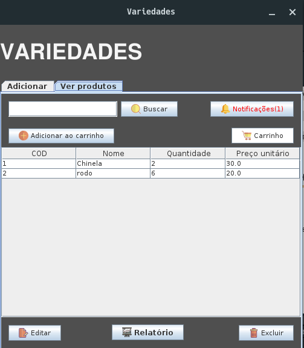

# Gerenciador de Estoque

> Projeto com objetivo de gerenciar estoques e gerar pdf's de compras realizadas pelos clientes.

## 📝 Licença

Esse projeto está sob licença. Veja o arquivo [LICENSE.md](https://www.mit.edu/~amini/LICENSE.md) para mais detalhes.
